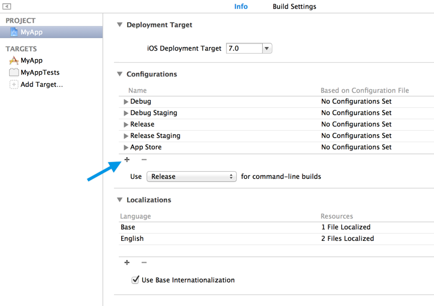
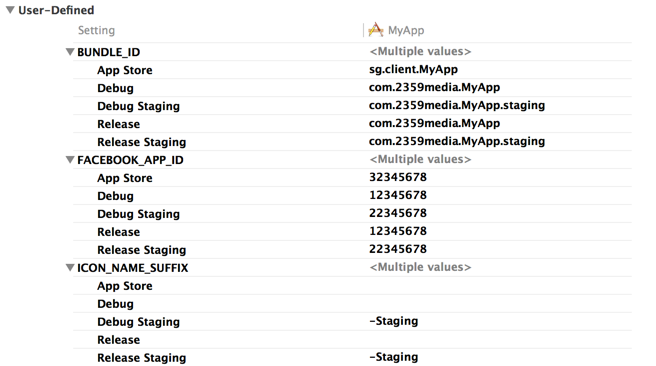
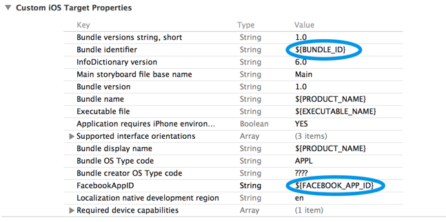
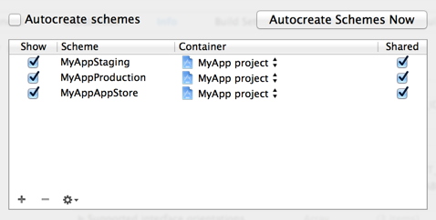
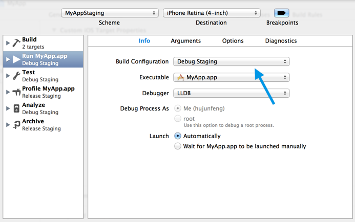

# iOS Development Guide

This is the first draft of the guide.

## Table of Contents

* [Why This Is Required](#why-this-is-required)
* [Swift Coding Conventions](#swift-coding-conventions)
* [Project Technical Conventions](#project-technical-conventions)
    * [Xcode](#xcode)
  * [CocoaPods](#cocoapods)
    * [Graphic Assets](#graphic-assets)
    * [Groups Structure in Project Navigator](#groups-structure-in-project-navigator)
    * [Warnings](#warnings)
    * [Staging vs Production vs App Store](#staging-vs-production-vs-app-store)
    * [Instruments](#instruments)
    * [Unit Testing](#unit-testing)
    * [SDK Compatibility](#sdk-compatibility)
* [Recommended Third-party Libraries](#recommended-third-party-libraries)
    * [Networking](#networking)
    * [JSON Parsing](#json-parsing)
    * [Urban Airship (Device Registration)](#urban-airship-device-registration)
    * [HUD](#hud)
    * [Reachability](#reachability)
    * [Pull-to-Refresh](#pull-to-refresh)
    * [Social Network](#social-network)
    * [UICollectionView on iOS 5.x](#uicollectionview-on-ios-5x)
    * [Attributed Label](#attributed-label)
    * [Sidebar Menu (Hamburger UI)](#sidebar-menu-hamburger-ui)
    * [UIView (Nib Loading and Geometry Shortcuts)](#uiview-nib-loading-and-geometry-shortcuts)
    * [Page Control](#page-control)
    * [UIAlertView and UIActionSheet (Block-based wrappers)](#uialertview-and-uiactionsheet-block-based-wrappers)
* [Git](#git)
    * [Pull Request](#pull-request)
* [Version Numbers](#version-numbers)
* [References](#references)

## Why This Is Required

This guide should be considered as rules for first timers, but
guidelines for experienced developers.

## Swift Coding Conventions

Follow the Style_Guide document.

## Project Technical Conventions

### Xcode

Always use the most recent release version of Xcode. You can download it from [Mac
App Store](https://itunes.apple.com/en/app/xcode/id497799835?mt=12) or
at [Apple developer center](https://developer.apple.com/downloads).

However, if a project still requires a base SDK of an old version of
iOS, it'd handy to keep the lastest version of Xcode that supports the
old SDK. For example, during the transition from iOS 6 to iOS 7, some legacy
projects might not be ready to upgrade to iOS 7 SDK, because it would require
a lot of effort to do so. In that case, we still need to keep Xcode
4.6.3 (and iOS 6 SDK) for these projects.

* Add old SDKs in new Xcode

    Each version of Xcode comes with only one SDK. For example, Xcode 5
    comes with iOS 7.0 SDK while Xcode 4.6 comes with iOS 6.1 SDK.
    It's however possible to add iOS 6.1 SDK from Xcode 4.6 to Xcode 5.
    To do that, you simply copy the iOS 6.1 SDK folder inside Xcode 4.6
    app bundle to the same position in Xcode 5 app bundle. Assuming you
    rename Xcode 4.6 app bundle to `Xcode4.app`, this is the command to do
    that:

    cp /Applications/Xcode4.app/Contents/Developer/Platforms/iPhoneOS.platform/Developer/SDKs/iPhoneOS6.1.sdk /Applications/Xcode.app/Contents/Developer/Platforms/iPhoneOS.platform/Developer/SDKs

    If you prefer symbolic link instead of copying the entire folder,
    use this command:

    ln -s /Applications/Xcode4.app/Contents/Developer/Platforms/iPhoneOS.platform/Developer/SDKs/iPhoneOS6.1.sdk /Applications/Xcode.app/Contents/Developer/Platforms/iPhoneOS.platform/Developer/SDKs

### CocoaPods

Use [CocoaPods](http://cocoapods.org) to manage libraries. Don't copy
library source files into the project.

There is a repository of CocoaPods specifications (`podspec`):
[CocoaPods/Specs](https://github.com/CocoaPods/Specs), which contains
most of the common libraries. To add a library dependency, specify the
name and the version.

* Library with `podspec` in
  [CocoaPods/Specs](https://github.com/CocoaPods/Specs)

    pod 'AFNetworking', '2.0.0-RC3'

You can also specify a library that is outside of CocoaPods/Specs.

* Library with `podspec` in the root of the repository. Either local
  repositories or remote repositories.

    pod 'AFNetworking', :path => '~/Documents/AFNetworking'
    pod 'AFNetworking', :git => 'https://github.com/AFNetworking/AFNetworking.git'

If a library doesn't have a `podspec`, you can create a `podspec` on
your own and host it in somewhere like [gist.github.com](), or even in a
local folder.

* Library without `podspec`. Create `podspec` on you own.

    pod 'JSONKit', :podspec => 'https://raw.github.com/gist/1346394/1d26570f68ca27377a27430c65841a0880395d72/JSONKit.podspec'
    pod 'JSONKit', :path => '~/Documents/JSONKit.podspec'

### Graphic Assets

* Use [Asset Catalogs](https://developer.apple.com/library/ios/recipes/xcode_help-image_catalog-1.0/Recipe.html) in Xcode 5.
* Must include both @1x and @2x sizes.
* Use JPEG format for large images, e.g. background images.

### Groups Structure in Project Navigator

Assuming *MyApp* is the project name, we recommend following these conventions:

* Only 4 groups at the top level: **MyApp**, **MyAppTests**,
  **Frameworks**, **Products** and **Pods**.
* `AppDelegate` should be in the root level of **MyApp**, not inside
  any of its subgroups.
* **MyApp** has 8 subgroups:
    * __Storyboards__: obviously storyboard files
    * __Models__: all model classes, including Core Data classes and
      `xcdatamodeld` file
    * __Views__: all custom views, e.g. custom table view cells
    * __Controllers__: all view controllers go here
    * __Managers__: other controller-like classes that are not view
      controllers, for example, a http client class that handles all the
      API calls
    * __Categories__: all categories
    * __Resources__: resource files, like images, custom fonts or
      preloaded data
    * __Supporting Files__: a default group with Xcode template
* No group for external libraries. Use CocoaPods to manage them.

### Warnings

No warning is allowed in release builds. Treat warnings as errors.

### Staging vs Production vs App Store

Use [Xcode Scheme](scheme), [Build Configuration](build-config) and
[Build Settings](settings) to manage different builds, like staging
build, production build or App Store build.

1.  Create Build Configurations.

    Both staging and production builds require Debug and Release
    configuration, while App Store only need Release configuration. As a
    result, we usually create 5 build configurations: **Debug**, **Debug
    Staging**, **Release**, **Release Staging** and **App Store**. Note
    that **App Store** is created by duplicating **Release**
    configuration.

    

2.  Add User-Defined Build Settings.

    Typically, we will create User-Defined Settings for Bundle ID, app
    icon names, Facebook App ID, etc. So we will be able to set different
    Bundle ID, icon names or Facebook App ID for different Build
    Configurations.

  

    These settings will be used in Info.plist. If the User-Defined
    Setting is `FACEBOOK_APP_ID`, you use it in Info.plist with
    `${FACEBOOK_APP_ID}`.

  

3.  Create Schemes with Build Configurations.

    Each build needs one Scheme, so we will create 3 Schemes:
    **MyAppStaging**, **MyAppProduction** and **MyAppAppStore**, for
    staging build, production build and App Store build respectively.
    Note that these schemes should be marked "Shared", so that they will
    be added in the Git repository.

  

    **MyAppStaging** Scheme uses **Debug Staging** and **Release
    Staging**.

  

     Similarly, **MyAppProduction** Scheme uses **Debug** and
     **Release**, and **MyAppAppStore** Scheme uses only **App Store**.
     It's summarized in the followed table.

    

After we have Schemes, we can, for example, switch to staging
build by easily selecting **MyAppStaging** Scheme. Bundle ID, Facebook
App ID and app icon will be changed automatically.

In order to change the Base URL of API server for staging or production,
we can implement a function that returns the correct URL based on Bundle
ID. For example, the following function returns the staging Base URL if
the Bundle ID has a prefix of `com.example`.

```objective-c
NSString * MDABaseURL()
{
    if ([[[NSBundle mainBundle] bundleIdentifier] hasPrefix:@"com.example"]) {
        return @"http://myapp-staging.example.net";
    }
    else {
        return @"http://myapp.example.net";
    }
}
```

[scheme]: https://developer.apple.com/library/ios/featuredarticles/XcodeConcepts/Concept-Schemes.html#//apple_ref/doc/uid/TP40009328-CH8-SW1
[build-config]: https://developer.apple.com/library/ios/recipes/xcode_help-project_editor/Articles/BasingBuildConfigurationsonConfigurationFiles.html
[settings]: https://developer.apple.com/library/ios/featuredarticles/XcodeConcepts/Concept-Build_Settings.html#//apple_ref/doc/uid/TP40009328-CH6-SW1

### Instruments

Use Instruments to profile your app. For example, locating memory issues, analyzing CPU usage, mesauring I/O acitivity or graphics peformance.

Resources for learning Instruments:

- [Instruments User Guide](https://developer.apple.com/library/ios/documentation/DeveloperTools/Conceptual/InstrumentsUserGuide/InstrumentsQuickStart/InstrumentsQuickStart.html)
- [WWDC 2010 Advanced Memory Analysis with Instruments](https://developer.apple.com/videos/wwdc/2010/?id=311)
- [WWDC 2010 Advanced Performance Analysis with Instruments](https://developer.apple.com/videos/wwdc/2010/?id=309)
- [WWDC 2011 iOS Performance and Power Optimization with Instruments](https://developer.apple.com/videos/wwdc/2011/?id=312)
- [WWDC 2011 iOS Performance in Depth](https://deimos.apple.com/WebObjects/Core.woa/BrowsePrivately/adc.apple.com.8266478284.08266478290.8365294559?i=1110158471)
- [WWDC 2012 Learning Instruments](https://developer.apple.com/videos/wwdc/2012/?id=409)
- [WWDC 2012 iOS App Performance: Responsiveness](https://developer.apple.com/videos/wwdc/2012/?id=235)
- [WWDC 2012 iOS App Performance: Graphics and Animations](https://developer.apple.com/videos/wwdc/2012/?id=238)
- [WWDC 2012 iOS App Performance: Memory](https://developer.apple.com/videos/wwdc/2012/?id=242)
- [WWDC 2013 Fixing Memory Issues](https://developer.apple.com/wwdc/videos/?id=410)
- [WWDC 2013 Core Data Performance Optimization and Debugging](https://developer.apple.com/wwdc/videos/?id=211)

### Unit Testing

Create unit tests for critical code. Especially, test the following
cases:

- Complex code that have many edge cases to consider.
  Write unit tests to cover these edge cases.
- Whenever a bug is found, write a unit test to cover it before fixing
  the bug.

Resources for getting started with unit testing in Xcode 5:

- [Unit Test Your App](https://developer.apple.com/library/ios/documentation/ToolsLanguages/Conceptual/Xcode_Overview/UnitTestYourApp/UnitTestYourApp.html)
- [WWDC 2013 Testing in Xcode 5](https://developer.apple.com/wwdc/videos/?id=409)

### SDK Compatibility

It's quite often that we need to support older iOS versions. There are few ways to do this:

- From Apple Documentation's [SDK Compatibility Guide](https://developer.apple.com/library/ios/documentation/DeveloperTools/Conceptual/cross_development/Introduction/Introduction.html).

- From a more simplified article in Ray Wenderlich's [Supporting Multiple iOS Versions and Devices](http://www.raywenderlich.com/42591/supporting-multiple-ios-versions-and-devices).

But, the most obvious way is by checking the Foundation framework version number:

    if (floor(NSFoundationVersionNumber) <= NSFoundationVersionNumber_iOS_6_1) {
        // Handle the case for iOS 6.1 or earlier
    } else {
        // Handle the case for iOS 7 or later
    }

Also, make sure to read [Supporting iOS 6](https://developer.apple.com/library/ios/documentation/userexperience/conceptual/transitionguide/SupportingEarlieriOS.html) in iOS 7 UI Transition Guide.

## Recommended Third-party Libraries

Here are a list of libraries that are widely used in our projects.
Developers are recommended to choose the listed library for that
particular feature. If, however, developers want to use a different
library or experiment a new library. Please [create a new
issue](https://github.com/2359media/ios-dev-guide/issues/new) to argue
that why an alternate library is better.

### Networking

[AFNetworking](https://github.com/AFNetworking/AFNetworking) by Mattt Thompson

> A delightful iOS and OS X networking framework.
> http://afnetworking.com

AFNetworking 2.0 officially supports iOS 6+, Mac OS X 10.8+, and Xcode 5. If you'd like to use AFNetworking in a project targeting a base SDK of iOS 5, or Mac OS X 10.7, use the latest tagged 1.x release. For iOS 4.3 and Mac OS X 10.6 support, use the latest tagged 0.10.x release.

### JSON Parsing

1. [NSJSONSerialization](https://developer.apple.com/library/ios/documentation/Foundation/Reference/NSJSONSerialization_Class/Reference/Reference.html) (iOS 5+)

2. [JSONKit](https://github.com/johnezang/JSONKit) by John Engelhart

> A Very High Performance Objective-C JSON Library

### Urban Airship (Device Registration)

[AFUrbanAirshipClient](http://github.com/AFNetworking/AFUrbanAirshipClient) by Mattt Thompson

> An API Client for Registering and Unregistering Devices with Urban Airship.

### HUD

[SVProgressHUD](https://github.com/samvermette/SVProgressHUD) by Sam Vermette

> A clean and lightweight progress HUD for your iOS app.
> <http://samvermette.com/199>

### Reachability

[Reachability](https://github.com/tonymillion/Reachability) by Tony Million

> ARC and GCD Compatible Reachability Class for iOS and MacOS. Drop in replacement for Apple Reachability.

### Pull-to-Refresh

1. [UIRefreshControl](https://developer.apple.com/library/ios/documentation/uikit/reference/UIRefreshControl_class/Reference/Reference.html) (iOS 6+)

2. [SVPullToRefresh](https://github.com/samvermette/SVPullToRefresh) by Sam Vermette

> Give pull-to-refresh & infinite scrolling to any UIScrollView with 1 line of code.
> <http://samvermette.com/314>

### Social Network

1. [UIActivityViewController](https://developer.apple.com/library/ios/documentation/uikit/reference/UIActivityViewController_Class/Reference/Reference.html)

  Use system sharing sheet, so no custom UI is allowed. Use it whenever possible.

2. [Social.framework](https://developer.apple.com/library/ios/documentation/Social/Reference/Social_Framework/_index.html) (iOS 6+)

3. [Twitter.framework](https://developer.apple.com/library/ios/documentation/Twitter/Reference/TwitterFrameworkReference/_index.html) (Twitter only and iOS 5 only, deprecated in iOS 6)

4. [Facebook SDK for iOS](https://developers.facebook.com/docs/ios/) by Facebook

  Use it for everything related to Facebook, including Facebook login, Facebook sharing, user profile, friend list, etc.

### UICollectionView on iOS 5.x

[PSTCollectionView](https://github.com/steipete/PSTCollectionView) by Peter Steinberger

> Open Source, 100% API compatible replacement of UICollectionView for iOS4.3+

### Attributed Label

[TTTAttributedLabel](https://github.com/mattt/TTTAttributedLabel) by Mattt Thompson

> A drop-in replacement for UILabel that supports attributes, data detectors, links, and more

### Sidebar Menu (Hamburger UI)

[MMDrawerController](https://github.com/mutualmobile/MMDrawerController) by Mutual Mobile

> A lightweight, easy to use, Side Drawer Navigation Controller

### UIView (Nib loading and Geometry shortcuts)

[ViewUtils](https://github.com/nicklockwood/ViewUtils) by Nick Lockwood

> ViewUtils is a collection of category methods designed that extend UIView with all the handy little properties and functionality that you always wished were built-in to begin with.

### Page Control

[DDPageControl](https://github.com/ddeville/DDPageControl) by Damien DeVille

> An easily customizable alternative to UIKit's UIPageControl

### UIAlertView and UIActionSheet (Block-based wrappers)

[PSAlertView](https://github.com/steipete/PSAlertView) by Peter Steinberger

> Modern block-based wrappers for UIAlertView and UIActionSheet.

## Git

We use Git as our source code management (SCM) system. We host
repositories in GitHub. Here are the best practices of using
Git and GitHub.

* Commit early and commit often.

* Don't change published history. Particularly, don't rebase remote branch.

    > Once you git push your changes to the authoritative upstream
    repository or otherwise make the commits or tags publicly visible,
    you should ideally consider those commits etched in diamond for all
    eternity.

* Use git-flow.

    Gitflow is a Git workflow that Vincent Driessen introduced in his
    post [*A successful Git branching
    model*](http://nvie.com/posts/a-successful-git-branching-model/). In
    addition to that, he released
    [git-flow](http://github.com/nvie/gitflow), which is a collection of
    Git extensions to provide high-level repository operations for his
    branching model.

* Write good commit messages.

    Here's a model Git commit message:

        Capitalized, short (50 chars or less) summary

        More detailed explanatory text, if necessary.  Wrap it to about 72
        characters or so.  In some contexts, the first line is treated as the
        subject of an email and the rest of the text as the body.  The blank
        line separating the summary from the body is critical (unless you omit
        the body entirely); tools like rebase can get confused if you run the
        two together.

        Write your commit message in the imperative: "Fix bug" and not "Fixed bug"
        or "Fixes bug."  This convention matches up with commit messages generated
        by commands like git merge and git revert.

        Further paragraphs come after blank lines.

        - Bullet points are okay, too

        - Typically a hyphen or asterisk is used for the bullet, preceded by a
          single space, with blank lines in between, but conventions vary here

        - Use a hanging indent

    Read [Tim Pope](http://tpo.pe/)'s post [*A Note About Git Commit
    Messages*](http://tbaggery.com/2008/04/19/a-note-about-git-commit-messages.html)
    for more discussions.

* Integrate Pivotal Tracker.

    If a commit has related Pivotal Tracker stories, use Pivotal Tracker
    post-commit hooks to link the commits to the particular stories. For
    all the details, including commit syntax as well as instructions on
    how to enable SCM integration, please see the [API help
    page](https://www.pivotaltracker.com/help/api?version=v5#Tracker_Updates_in_SCM_Post_Commit_Hooks).

    Here're some typical commit messages that include Pivotal Tracker
    post-commit hooks:

    * [#53928321] Create editorial page
    * [Fix #55789490] "$" sign appears in a wrong position
    * [Finish #53870315] Update icons for review buttons

Also see [*Commit Often, Perfect Later, Publish Once: Git Best
Practices*](http://sethrobertson.github.com/GitBestPractices/) for more
discussions.

### Pull Request

We use [Pull Requests][using-pr] to initiate code review and genenral
discussion about changes before being merged into a main branch.

We follow the [maintainer/contributors workflow][pr-workflow]. The tech
lead of each project is the maitainer, who will review the pull requests
submitted by the contributors before merging them into the main branch.
The reset of developers in the team are the contributors, who will
submits their changes through pull requests.

[using-pr]: https://help.github.com/articles/using-pull-requests
[pr-workflow]: https://github.com/2359media/ios-dev-guide/blob/master/Pull%20Request%20Workflow.md

## Version Numbers

Please use the following convention:

    <major>.<minor>.<update/bug fix>.<build>

The build number should increment with each build, it never resets. A Beta or pre-release application has the following 0.9.0.12

## References

- [iOS Developer Library](https://developer.apple.com/library/ios) is
where you can find all the [programming guides][guides], [class
references][references], [sample code][code], [videos][videos], etc.

- [NSBlog](https://mikeash.com/pyblog/) by [Mike Ash](https://mikeash.com).

- [objc.io](http://www.objc.io/) by [Chris Eidhof](http://eidhof.nl), [Florian Kugler](http://floriankugler.com) and [Daniel Eggert](https://twitter.com/danielboedewadt).

- [NSHipster](http://nshipster.com) by [Mattt Thompson](http://mattt.me/).

@phatle collects a huge number of references in his [iOS Topics and
References][t&r], and they are grouped by topics for easily looking up.
It's a handy document for developers who just start out iOS development.

[guides]: https://developer.apple.com/library/ios/navigation/#section=Resource%20Types&topic=Guides
[references]: https://developer.apple.com/library/ios/navigation/#section=Resource%20Types&topic=Reference
[code]: https://developer.apple.com/library/ios/navigation/#section=Resource%20Types&topic=Sample%20Code
[videos]: https://developer.apple.com/library/ios/navigation/#section=Resource%20Types&topic=Video
[t&r]: https://github.com/2359media/ios-dev-guide/blob/master/iOS%20Topics%20and%20References.md
